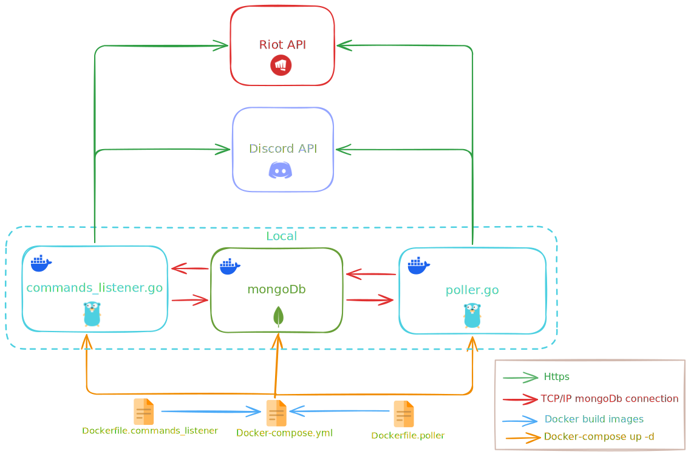

# LoL LP Tracker Discord Bot

A Discord bot that tracks League of Legends players' ranked LP (League Points) and statistics.

## Features (Not implemented Yet)

- 📊 Track multiple players' LP and rank changes
- 🏆 Support for all major regions (EUW, NA, KR, etc.)
- 💾 MongoDB database for persistent storage
- 🤖 Discord slash commands interface
- 🔄 Real-time rank updates

## Commands
Add a player to tracking
```bash
/add_player <name> <tagline> <server>
```
Show all tracked players
```bash
/list_players
```

## Architecture



## Requirements

- Go 1.19+
- MongoDB (local or cloud)
- Discord Application/Bot
- Riot Games API Key

## Quickstart

### environment variables

Create a .env file at the root of the project with the following structure (replace with your own values) :

```yaml
MONGO_ROOT_USERNAME: <admin_username>
MONGO_ROOT_PASSWORD: <admin_password>
MONGO_DATABASE: <database_name>

RIOT_API_KEY: <Riot_API_Key>

DISCORD_TOKEN: <Discord_API_Key>
```

### Create lp_tracker go module and install dependencies

```bash
go mod init lp_tracker

go mod tidy
```

### Run docker containers

```bash
docker-compose up -d
```

## Project Structure

lp_tracker/
├── container/           # Dependency injection
├── database/            # MongoDB connection and management
├── discord/             # Discord bot commands and handlers
├── models/              # Data models (models/repositories design pattern)
├── repositories/        # Repositories
├── services/            # Services for Riot API
├── docker-compose.yml   # Docker compose to run mongodb, poller and command_listener services
├── Dockerfile           # Docker Images for poller and command_listener
├── commands_listener.go # Command_listener entry point
├── poller.go            # poller entry point

## Basics go commands

### Build, Run commands

```bash
# run go script
go run main.go

# Compile (create an executable)
go build

# Compil with a specific name
go build -o mon-app

# Instal the binary in $GOPATH/bin
go install
```

### Tests and format

```bash
# run all tests
go test ./...

# run test with verbosity
go test -v ./...

# format
go fmt ./...

# Analys code to detect problems
go vet ./...
```

### Dependencies

```bash
# Add dependency
go get package-name

# Add specific version
go get package-name@v1.2.3

# Update dependency
go get -u package-name

# List all modules used
go list -m all
```

## Docker Compose

### Basic commands

```bash
# run docker-compose script in detached mode
docker-compose up -d

# Rebuild images before starting containers
docker-compose up --build

# Stop services
docker-compose down

# Stop containers and delete volumes
docker-compose down -v

# Show containers logs
docker-compose logs

#  Show logs of a specific container
docker-compose logs nom-du-service
```
